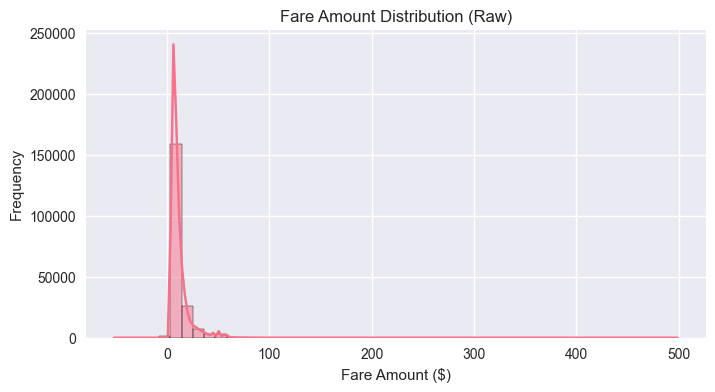
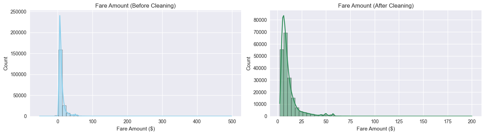
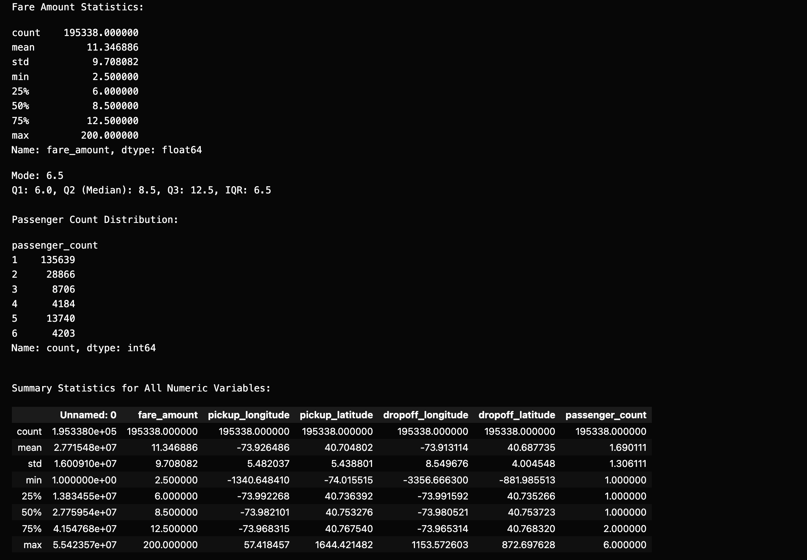
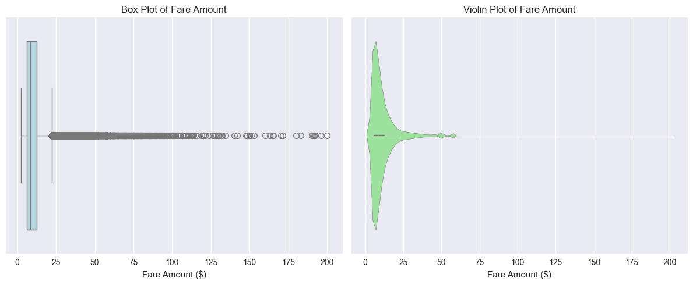
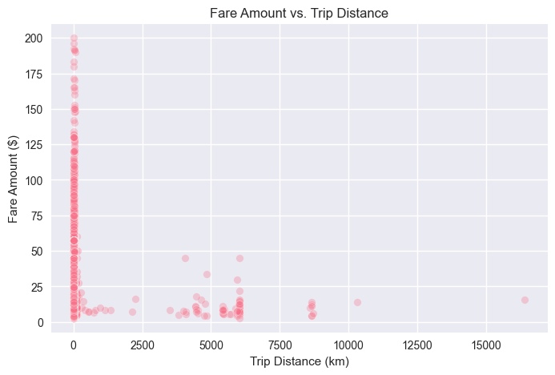
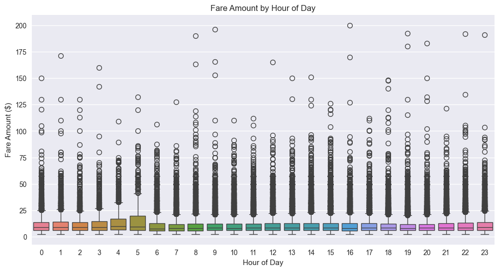
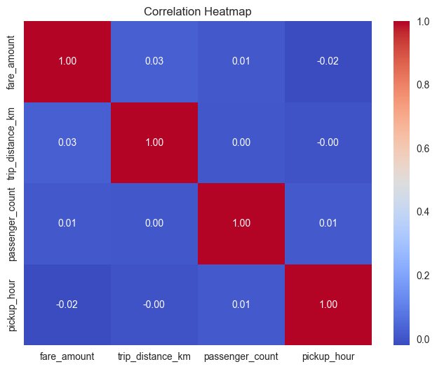
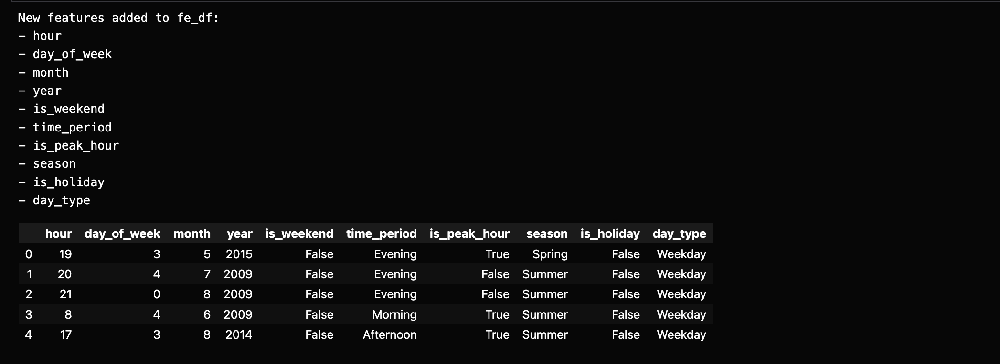
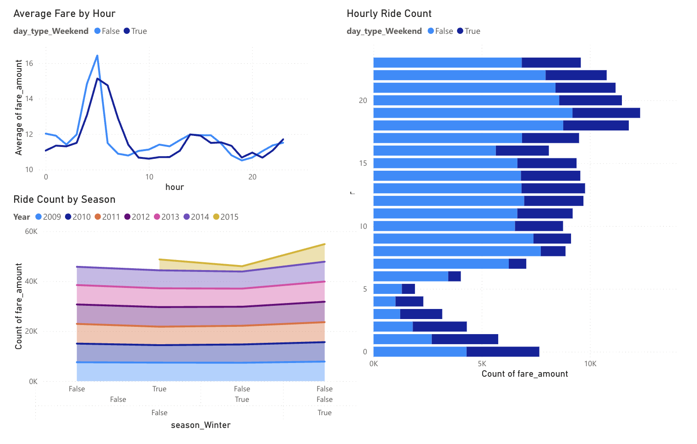

# Uber Fare Analysis Project

**Course:** Introduction to Big Data Analytics (INSY 8413)  
**Project:** Uber Fares Dataset Analysis using Power BI  
**Author:** 24613 Ngwije Ngabo Gerard
**Deadline:** July 27, 2025

## Project Overview

This project analyzes the Uber Fares Dataset to gain comprehensive insights into fare patterns, ride durations, and key operational metrics. The analysis includes data cleaning, exploratory data analysis (EDA), feature engineering, and an interactive Power BI dashboard.

## Project Structure

```
├── README.md                           # Project documentation
├── notebooks/
│   └── uber_fare_analysis.ipynb       # Main analysis notebook
├── data/
│   ├── raw/                           # Original dataset
│   ├── cleaned/                       # Cleaned dataset
│   ├── enhanced/                      # Feature-engineered dataset
│   └── final/                         # Power BI ready dataset
├── outputs/
│   ├── plots/                           # screenshots
│   └── report/                         # Final report
└── powerbi/
    └── Uber-fare-analysis-powerbi.pbix   # Power BI dashboard
```

## Setup Instructions

### 1. Environment Setup

```bash
source uber-analysis-env/bin/activate

pip install -r requirements.txt

```

###

### 3. Analysis Workflow

1. **Data Acquisition:** Load and inspect the raw dataset
2. **Data Exploration:** Understand data structure and quality
3. **Data Cleaning:** Handle missing values and outliers
4. **Exploratory Analysis:** Generate insights and statistics
5. **Feature Engineering:** Create temporal and derived features
6. **Power BI Development:** Create interactive dashboard

## Key Features

- **Comprehensive EDA:** Statistical analysis and visualizations
- **Temporal Analysis:** Time-based patterns and trends
- **Feature Engineering:** Enhanced dataset with derived metrics
- **Interactive Dashboard:** Professional Power BI visualization
- **Documentation:** Complete process documentation

## Technology Stack

- **Python:** Data analysis and processing
- **Pandas:** Data manipulation
- **Matplotlib/Seaborn:** Static visualizations
- **Plotly:** Interactive visualizations
- **Jupyter Notebook:** Analysis environment
- **Power BI:** Dashboard creation

## Project Deliverable

Below is a checklist of all required deliverables for this project:

- [ ] **Jupyter Notebook with Full Analysis**  
  - File: `notebooks/uber_fare_analysis.ipynb`
  - Contains: Data loading, cleaning, EDA, feature engineering, code, and visualizations

- [ ] **Cleaned Dataset**  
  - File: `data/cleaned/uber_cleaned.csv`
  - Output of the data cleaning process

- [ ] **Enhanced Dataset (Feature Engineered)**  
  - File: `data/enhanced/uber_enhanced.csv`
  - Output of feature engineering, ready for Power BI

- [ ] **Power BI Dashboard File**  
  - File: `powerbi/Uber-fare-analysis-powerbi.pbix`
  - Contains: Interactive dashboard and visualizations

- [ ] **Screenshots of Key Charts & Dashboard**  
  - Folder: `outputs/plots/`
  - Includes: Screenshots for each notebook step and Power BI dashboard

- [ ] **Final Report**  
  - File: `outputs/reports/final_report.md`
  - Summary of methodology, findings, and recommendations

- [ ] **README.md**  
  - File: `README.md`
  - Project overview, setup, workflow, results, and submission instructions

---

## Results & Insights

Below are key results and where to find the corresponding screenshots for each step of the analysis:

- **Data Loading & Initial Exploration**

  

- **Initial Data Quality Assessment**

  

- **Data Quality Report & Before/After Comparison**

  

- **Descriptive Statistics**

  

- **Fare Distribution Visualizations**

  

- **Fare Amount vs. Distance Traveled**

  

- **Fare Amount vs. Time of Day**

  

- **Correlation Analysis**

  

- **Feature Engineering**

  

- **Power BI Dashboard**

  

## Contact

**Email:** gerardngwije@gmail.com

---
